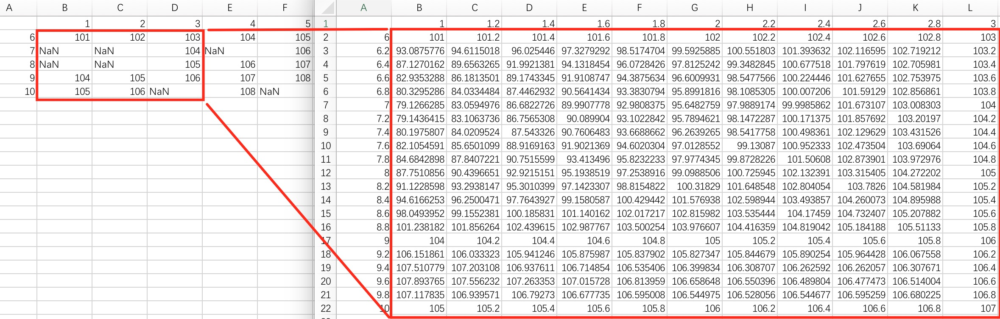
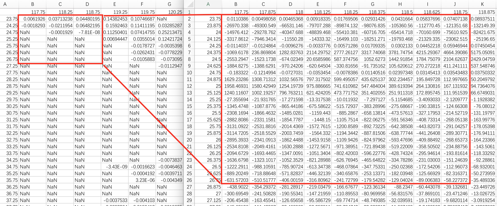
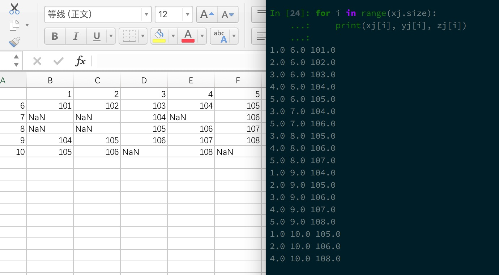

## 文件说明
1. [`minisome.csv`](./minisome.csv)是自己手动构造的数据文件，数据精度低，差值明显，整数化，量小。(代码默认)
2. [`some.csv`](./some.csv)是项目的源数据之一，精度高，量相对大。
3. 直接修改代码`csv = np.genfromtxt('minisome.csv',delimiter=',')`对两种不同文件进行试验。统一导出文件：`somenew.csv`。

## 目的
1. [scipy.interpolate.interp2d](https://docs.scipy.org/doc/scipy/reference/generated/scipy.interpolate.interp2d.html#scipy.interpolate.interp2d)文档中提及到参数中的x,y可以是向量（表格）形式：`x = [0,1,2];  y = [0,3]; z = [[1,2,3], [4,5,6]] `，也可以是一维形式：（应当注意到`len(z) == len(x) == len(y)`，且一一对应）
    ```
    x = [0,1,2,0,1,2]
    y = [0,0,0,3,3,3]
    z = [1,2,3,4,5,6]
    ```
2. 因此该代码是试验：
    + 数据存取在csv中，是网格形式，但并非所有（网格）坐标点都有值。
    + 把数据读出来后，把非nan值留下，组成上述格式的x,y,z（也即真正的传参并非一个网格）。例如：
    ```
    x = [0,2,1,2]
    y = [0,0,3,3] # 共4个点(0,0)(2,0)(1,3)(2,3)
    z = [1,3,5,6] # 对应值为1，2，5，6
    ```
    + 测试interp2方法能否适用。

## 运行
1. py版本：`Python3.x`。需要第三方库：`numpy, scipy, pandas`。
2. 会有`RuntimeWarning`。***结果其实就是给nan的点插值***，看下图：
3. 如果数据很精细，那么具体的警告信息是不一样的，结果是插值后数据异常（或者说我暂时没找到规律），原来有值的地方值不一样，有些地方值变得异常大或异常小。
3. 说明interp2方法接受这样的参数（官网也说明了），

## 建议
1. 使用ipython运行：`%run 1Dxyzinterptest.py`（先进入工作目录）。这样就可以查看各个参数：`xj, yj, zj`
2. 查看x,y,z是否一一对应：
    ```
    for i in range(10):
        print(xj[i], yj[i], zj[i])
    ```
    + 通过对比源数据文件就会发现是一一对应
