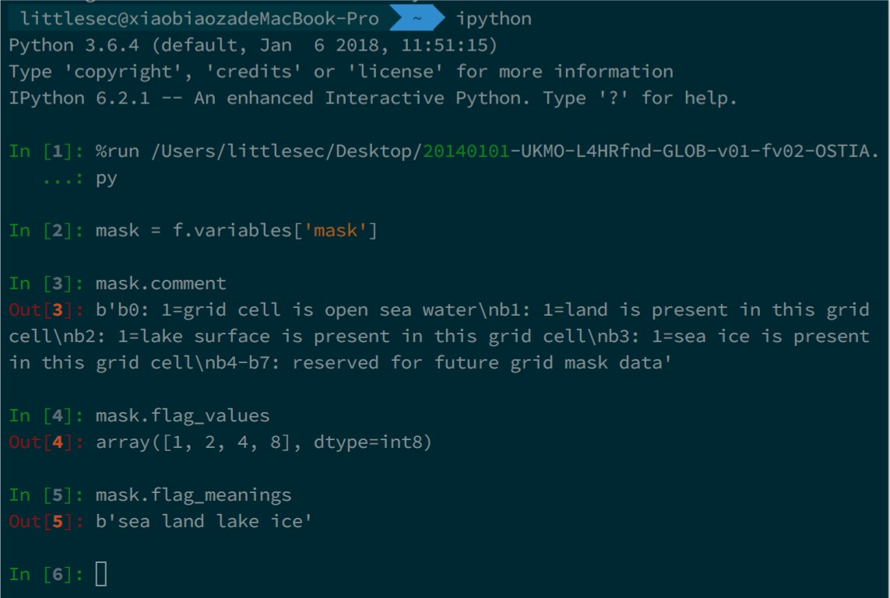
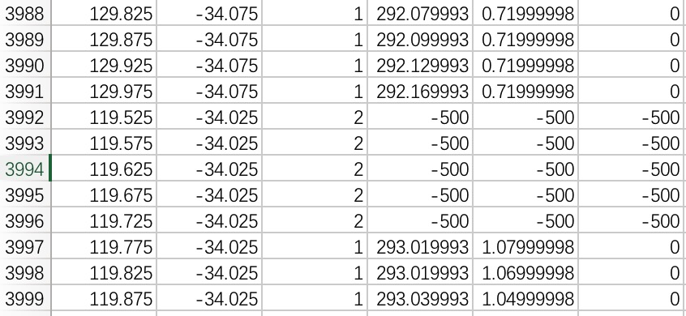

> 原始nc数据文件超过100M，无法上传到GitHub，之后以网盘形式分享。

## 代码说明
1. 原始nc数据文件是全球范围的文件，程序用于截取黄海渤海海域的数据，经度范围119.525-129.975（索引5990-6200），纬度范围-34.975--24.525（索引1100-1310），并以类似于关系数据库的形式存于csv文件。
2. 共4个测量值，mask类似于掩码属性，用于指示该位置的地理属性，其值类似于8选1逻辑电路（8位中有且仅有1位是有效位，其他为无效位），高4位预留给未来使用，低4位中b0为1表示该位置为海洋，b1为1表示该位置为陆地，b2为1表示湖泊，b3为1表示冰川，因此，实际上mask的值只能是1、2、4、8里的其中一个，分别对应的地理属性为海洋、陆地、湖泊、冰川。（nc文件中有说明）
3. 另外三个测量值的缺失值统一用-500代替。用execl打开导出的csv通过筛选功能可知这些-500的点对应的mask属性一定是2或8，其中该nc文件中mask的值只有1和2，因此-500的地方的mask一定是2，并且三个属性应当同时为-500。
4. 该nc文件里的三个测量值都有比例因子`scale_factor`和偏移量`add_offset`。

## 适用情况
1. 如果nc文件中有mask属性，其他测量值均由比例因子和偏移量，而时间和深度只有一个值，需要将数据导出成一个csv文件，那么可以使用该代码。
2. 可能需要修改的地方：
    + 读取的文件名`fileName`；
    + 根据需要修改缺失值替代值`nanValue`（每个观测值提供缺失值字段，默认字段名是`_FillValue`）
    + 如果要截取经纬度范围，需要你事先知道经纬度的索引`lonIndex1, lonIndex2, latIndex1, latIndex2`（后期有时间我会加入专门的函数方便获知索引）；
    + 根据观测值的名称修改`keyList``变量；
    + 导出的文件名`csvName`